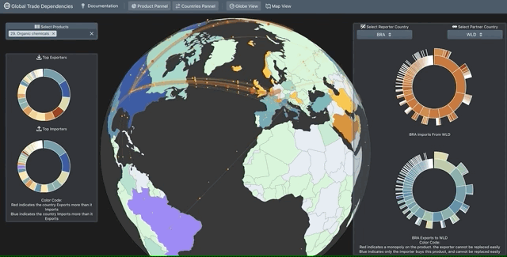
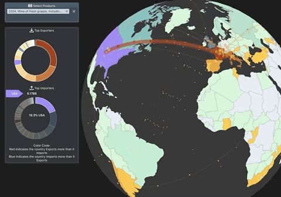

# tradeVisualizationD3

Hosting Status: Waiting for approval from comtrade to publish with their data

Visualization Example: https://observablehq.com/@raphaelcharriez/dynamic-flows-on-a-map

## Concept:  

Modelling international trade is difficult. Trade is intricate and variable, its shape naturally adjusts to conflicts, innovations, politics ect. This makes reliable data collection, analysis and presentation a challenging problem. The most sophisticated trade-related models become obsolete when some geopolitical variables are adjusted. 

With the resurgence of protectionism after an era of free trade the ability to precisely evaluate current and future global trade patterns is more important than ever. 

In recognition of the need to do this important work, I’m exploring new quantitative ways to analyze trade relationships. I’m beginning with a fairly unambitious goal: I want to establish a way to quantify the relative dependency in a bilateral trade relationship over a single commodity. The methodology is inspired by the article :https://geopoliticalfutures.com/toward-new-understanding-world-trade/ which presents a   “by no means sacrosanct, nor is it a perfect representation of trade dependency. Howerer, it is a useful tool for starting a more holistic conversation about how trade works – a conversation sorely missing from the present media environment.”

## Modeling : 
One of the objectives is keeping the model as simple and intuitive as possible. And then focus on visualizing the data. 
* Export Dependencies: a country is dependant on an export relationship if 
  * It has many competitors exporting the same product. 
  * It doesn’t have many other choices of partners to export to 
  * We can represent that export dependency by taking the value of that export and divide it by the global value of export for the same product over a period of time:  export dependency(country a, country b, product p) (export from country a to country b for product p)/(total export product p)
* Import Dependencies: In the same way a country is dependant on import
  * It has many competitors importing the same product. 
  * It doesn’t have many other choices of partners to import from 
  * We can represent that export dependency by taking the value of that export and divide it by the global value of export for the same product over a period of time: import dependency(country a, country b, product p) =  (import from country a to country b for product p)/(total import product p)
* We then compute the following metric : export dependency - import dependency to evaluate who is the most dependant on that trade relation. 

## Data: 
We use the most granual trade data available, published by the united nations:https://comtrade.un.org/, process and enrich it with geographical informations for the visualisation. 

## Limits
The simple approach doesn't aim to give a complete pictures of all the forces that drive global trade patterns. It is meant to be used in combination with other tools, political context, and anedoctial evidences. The model itsel has the following limits.

* In the dependency calculus, we only consider the total amount of product exported to calculate the total volume of product available.
  * This doesn’t account for national, non exported productions that depending on the commodity should be very significant. Finding data that would be as granular as the comtrade data for national productions of every country would be impossible so we accept and acknowledge that limit.
  * For instance we won’t be able to see from the map that Unlike previous global powers, the United States, as well as North America, are to a great degree self-sufficient. Whatever the attractions of international trade, the U.S. in particular does not require trade to sustain itself
* It would be interesting to track how import are interconnected with the country’s economy. 
  * For instance china uses foreign microships in most of their technological products and are very dependent on those to produce and export and assemble IT. That’s outside of our scope. 
 
### Visualisation: 
The visualisation is inspired by https://bl.ocks.org/emeeks/21f99959d48dd0d0c746, which I wanted to use represent global trade in a dynamic way. 
The sunburst diagram is inspired by https://www.c4reports.org/lux-and-loaded’s report on North Korea’s luxury good imports  
 
### Workflow Example: 
To Do: US taxing France.

Let's look at the top imports from Frane declared by the US in 2018. 

Aircrafts Parts, Nuclear Components, and Pharmaceutical products are reciprocal and probably interconnected. On the other hand Beverage imports and Wine in particular are not symetrical. Let's click on the product. The map changes: 

France's export to the US dominates the market, the US has infinite leverage here. Especially since they have a local production that they don't seem to export much, to pursue the analysis further we would look for more detailed consumption data, local production, price elasticity models. 

 
### Technology used: 
Around ~50 million rows, few gb of data. 
Most common relational databases like Postgres and MySQL can handle that scale. I used Postgres + Express by familiarity 
The client backbone is react, more advanced visualisations are made with D3. 

